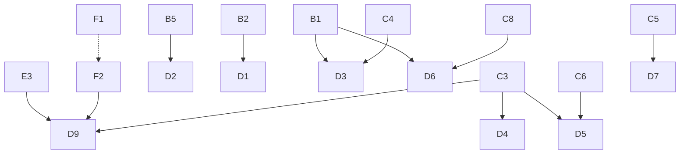

# Задачи P1 — детальная разбивка для исполнителей (агентов)

Разбивка раздела P1 из `REMAKE_TODO.md`. Каждая задача самодостаточна: контекст, шаги,
критерии приёмки, способ проверки. Задачи можно выдавать независимо, зависимости указаны явно.

## Общие сведения для любой задачи

- Сборка: `cmake --preset win-msvc-debug-vs2022 && cmake --build --preset win-msvc-debug-vs2022`
  (или открыть `build/akhenaten.sln`). Выход — `./build/`.
- Запуск без ресурсов игры: `--no-resource --nosound --window`; хот-релоад JS: `--mixed <path>`.
- Интеграционные тесты: `--integraltests`, скрипты в `tests/*.js` (см. `tests/README.md`).
  Скриншоты монументов: **без** `--no-resource`, `--screenshot-dir PATH`, Pharaoh data
  последним аргументом. Под `--no-resource` `graphics_save_screenshot` no-op (билдферма).
- Стиль: `git clang-format --style=file --extensions cpp,cc,cxx,h,hpp` перед коммитом.
- Архитектурное правило проекта: новая логика зданий/UI по возможности уводится в MuJS-конфиги
  (`src/scripts/building/*.js`), C++-класс регистрируется через
  `BUILDING_METAINFO(TYPE, class, base)` (`src/building/building.h:453`) и берёт статические
  параметры из конфига (`REPLICATE_STATIC_PARAMS_FROM_CONFIG`). **Amounts / фазы ресурсов
  монументов — в JS** (`placement_resources`, `timber_loads`, …), не хардкод в C++.
  Для фигур — `FIGURE_METAINFO` + конфиг в `figures.js`/`enemies.js`.
- Цель проекта — точное воспроизведение логики оригинального Pharaoh и совместимость
  с сейвами; «улучшайзинг» не делаем (CONTRIBUTING.md).
- В коммиты не добавлять атрибуцию Claude/Anthropic (правило репозитория).
- Процессные уроки (wiki, staffed SY, integral screenshots): **[REMAKE_NOTES.md §4](REMAKE_NOTES.md)**.

### Enum-типы монументов

В `building_type.h` coсуществуют legacy-ID (используются в меню и `MONUMENT_WEIGHTS`) и
runtime-ID (реальная регистрация METAINFO):

| Семейство | Legacy ID | Runtime ID (METAINFO) |
|-----------|-----------|------------------------|
| Small/medium stepped | — | 319+ (`BUILDING_SMALL_STEPPED_PYRAMID` = 319, medium = 324) |
| Large stepped | 250 | создаётся в C1 |
| True pyramids | 253–257 | создаётся в C3 |
| Bent / mudbrick | 241–247 | создаётся в C4/C5 |

Не путать legacy и runtime при регистрации классов и в save/load.

### MONUMENT_WEIGHTS (обязательно для блока C)

Любая задача блока C **обязана** добавить вес нового типа в
`src/scripts/city/monuments.js` (паттерн A3). Без записи в `MONUMENT_WEIGHTS` монумент
строится, но не влияет на рейтинг «монументы» (`if (!w) continue` в `:44-45`).

### Вторжения в миссиях — два API

| API | Требует B2 | Когда использовать |
|-----|------------|-------------------|
| `city.start_foreign_army_invasion({...})` | нет | Скриптовые миссии; пример — `m_008_selima.js:239` |
| `EVENT_TYPE_INVASION` из `.map`/редактора | да (B2) | Загрузка оригинального `.pak`, редактор сценариев |

В D-задачах явно указывать, какой API используется.

### Тесты

- **A / B / E:** интеграционный тест обязателен, где осмысленно.
- **C (монументы):** ручная проверка постройки + все фазы + save/load; общий monument-тест
  можно добавить в A3 или C1.

### Формат задачи

```markdown
### XN. Название
**Файлы:** ...
**Зависимости:** ... (или «нет»)
**Проблема:** ...
**Сделать:**
1. ...
**Приёмка:** ...
**Проверка:** ...
```

---

## Выполнено

| Волна | Задачи | Коммит |
|-------|--------|--------|
| 1 | A1 — medium stepped pyramid (типы в ctor/on_place) | `e630bd1fc` |
| 1 | A2 — medium mastaba config() | `e630bd1fc` |
| 1 | A3 — MONUMENT_WEIGHTS для stepped pyramids | `e630bd1fc` |
| 1 | A4 — уникальный enum BUILDING_MAUSOLEUM_2 | `e630bd1fc` |
| 2 | E1 — боевой корабль игрока (бой, приказы, repair) | `99f8dcd23` |
| 2 | E2 — транспортный корабль (embark/sail/disembark) | `99f8dcd23` |
| 2 | B1 — ветвление кампании и прогрессия рангов (JS) | `f5a17b591`, `bd1298219` |
| 2 | D1 — миссия 11 Serabit Khadim | `fa91fa687` |
| 3 | D2 — миссия 12 Meidum (врем. monument goal, сейчас 58 после F3, до C1) | `289614336` |
| 3 | D3a — миссия 13 Buhen (обелиск→мастаба до C7, goal 9) | `5f24d2a93` |
| 3 | D3b — миссия 14 South Dahshur (bent→medium stepped, сейчас 40 после F3, до C4) | `5f24d2a93` |
| 3 | D4 — миссия 15 North Dahshur (true→2×stepped, сейчас 58 после F3, до C3) | `9be082753` |
| 3 | D5 — миссии 16 Iunet / 17 On / 18 Rostja (18: sphinx+pyramid→stepped+mastaba, сейчас 67 после F3, до C3/C6) | `24aee4783` |
| 3 | F3 (частично) — форма формулы рейтинга: sqrt→аддитивная `2.25·Σ+4.5`; цели 12/14/15/18 пересчитаны, 17 On→оригинал 18. Калибровка весов по типам — осталась | `26bb0d1c1` |
| 3 | F1 — `enemies.js`: доля type3 у 5 наций (canaanite/kushite/nubian/phoenician/seapeople) сложена в type2; армии 11/13/15/16 спавнятся полностью | `915653ec0` |
| 3 | B5 — валидация `choice[]`: предикат `mission_is_playable`, фильтр неиграбельных целей, `compute_next` и guard хоста; тупик 18→19/20 закрыт | `d0bdd2d21` |
| 3 | F2 — вражеские колесницы: `figure_enemy_chariot` + METAINFO на все 12 `FIGURE_ENEMY_*_CHARIOT`; миссии 32/33 разблокированы; тест 39 | `3e8db22c8` |
| 4 | C4 — bent pyramid (small/medium + parts, реальный `PACK_BENT_PYRAMID` арт, веса, меню); миссия 14 → цель 21; 41/41 тестов | `412b7bc9b` |

---

## Блок B — инфраструктура кампании

### B1. Ветвление кампании и прогрессия рангов (JS-конфиги) ✅
**Файлы:** `src/scripts/missions.js`, `src/scripts/ui_mission_end_window.js`,
  `src/scripts/ui_mission_choice_window.js`, `src/scripts/mission/m_*.js`,
  `src/io/gamestate/boilerplate.cpp`, `src/game/player.cpp`.
**Зависимости:** нет.
**Контекст:** ветвление кампании идёт через **JS-конфиги миссий**, не через
`mission.cpp` / `campaign.txt`. Цепочка после победы:
`ui_mission_end_window.js` → `mission_has_post_victory_choice()` /
`mission_end_compute_next_scenario_id()` → `game_show_mission_choice()` →
`__game_load_mission()`. Поля в конфиге: `next_mission`, `choice[]` (с опциональным
`after` для фильтра по пройденной миссии). Старая C++-система (`find_next()`,
`requirements[]`, `is_step_unlocked()`) **не восстанавливается**.

Кампания Pharaoh содержит **12 пар** миссий на выбор (в первой редакции таблицы
пара 11/12 была пропущена — реализация в `m_010_saqqara.js` и брифинг Meidum
подтверждают выбор; пара 16/17 упомянута в D5, но в таблице отсутствует —
сверить с оригиналом при D5):

| Пара | scenario_id |
|------|-------------|
| Behdet / Abedju | 6 / 7 |
| Selima / Abu | 8 / 9 |
| Serabit Khadim / Meidum | 11 / 12 |
| Buhen / South Dahshur | 13 / 14 |
| Bahariya / Djedu | 19 / 20 |
| Dunqul / Dakhla | 21 / 22 |
| Thinis / Waset | 23 / 24 |
| Kebet / Menat Khufu | 25 / 26 |
| Iken / Sawu | 28 / 29 |
| Heh / Bubastis | 30 / 31 |
| Khmun / Sauty | 32 / 33 |
| Byblos / Baki | 34 / 35 |

**Особый случай (не choice):** финал New Kingdom — **36 Rowarty / 37 Hetepsenusret**.
Игрок **не выбирает** на экране: если прошёл Byblos (35) → Rowarty (36);
если Baki (34) → Hetepsenusret (37). В JS: `next_mission` на 34/35 указывает
на соответствующий финал (без `choice[]`).

**Сделано / сделать для каждой пары:**
1. `choice[]` на миссии **перед** развилкой (пример: Timna 5 → Behdet 6 / Abydos 7).
2. Выборы **независимы** (как в оригинале): после 6 или 7 — снова выбор 8/9; после 10 — 11/12.
3. После линейных миссий — `next_mission` (8/9 → 10).
4. `load_mission()` сохраняет `campaign_mission_rank`; `post_load()` не перезаписывает rank из legacy `campaign.txt`.
5. `__game_player_record_mission_win()` — запись результата в `player_scenario_records` (in-memory).
6. JS инкрементирует `scenario.campaign_mission_rank` на победе.

**Приёмка (миссии 0–10):** после 5 — выбор 6/7; после 6 **или** 7 — выбор 8/9 (независимо от первого выбора);
8/9 → 10; после 10 — выбор 11/12; rank растёт.
**Проверка:**
- Прогон: 5→6→9→10 и 5→7→8→10 (перекрёстные ветки)
- Прогон: 10→11 или 10→12

### B1b. Кампания Cleopatra (38–52): линейные цепочки, без choice
**Файлы:** `src/scripts/mission/m_038_*.js` … `m_052_*.js`, `src/game/mission.h`,
  экран выбора кампании (`ui_scenario_selection_campaign.js`).
**Зависимости:** B1 (общий JS-пайплайн `next_mission`; **без** `choice[]`).
**Контекст (оригинал):** дополнение *Cleopatra: Queen of the Nile* — **15 миссий**
в **4 отдельных кампаниях**. В отличие от Pharaoh (0–37):
- **нет** экранов выбора между двумя миссиями (`choice[]` не используется);
- кампании Cleo **не связаны** между собой — порядок прохождения произвольный
  (после патча Cleo: «Individual Missions» или любая из 4 кампаний);
- rank **не наследуется** из Family History Pharaoh — в брифингах имя правителя =
  исторический фараон миссии, не имя семьи игрока;
- в цепочке **Cleopatra's Capital** (48–52) часть построек и фортов **переносится**
  между миссиями (carry-over монументов/войск — отдельная механика, не B1).

Enum кампаний: `CAMPAIGN_CLEOPATRA_*` в `mission.h:118-121`.

| Кампания | `campaign_id` | Миссии (linear) | scenario_id |
|----------|---------------|-----------------|-------------|
| Valley of the Kings | 5 | Thutmose → Tut → Seti | 38 → 39 → 40 |
| Ramses II | 6 | Sumur → Qadesh → Abu Simbel → Ramses in the Valley | 41 → 42 → 43 → 44 |
| Ancient Conquerors | 7 | Pi-Yer → Migdol → Tanis | 45 → 46 → 47 |
| Cleopatra's Capital | 8 | Alexandria → Ptolemy's Alexandria → Maritis → Cleopatra's Alexandria → Actium | 48 → 49 → 50 → 51 → 52 |

**JS-шаблон для каждой миссии Cleo:**
1. Только `next_mission: N` (или `-1` / отсутствие — конец кампании на Actium 52).
2. **Не** добавлять `choice[]`.
3. Import в `missions.js`; отдельный `campaign_id` при старте из UI кампании.
4. Для 48–52: заложить hooks carry-over (войска/монументы) — P2, когда появится API.

**Подзадачи (по кампаниям, независимы, можно выдавать параллельно):**
- **B1b-VK** — Valley of the Kings (38→39→40);
- **B1b-R2** — Ramses II (41→42→43→44);
- **B1b-AC** — Ancient Conquerors (45→46→47);
- **B1b-CC** — Cleopatra's Capital (48→…→52, + hooks carry-over).

**Не путать с концом Pharaoh:** миссии 32–37 (New Kingdom основной игры) — это
**Pharaoh**, не Cleopatra; там есть choice-пары (32/33, 34/35) и условный финал 36/37
(см. B1). Cleo chronologically пересекается по сеттингу, но scenario_id 38+ — отдельные кампании.

**Приёмка:** каждая из 4 кампаний проходится линейно; после победы — автоматический
переход по `next_mission`; экран choice не появляется.
**Проверка:** прогон Valley of the Kings 38→39→40; Cleopatra's Capital 48→52;
старт кампании Cleo из меню без Family History Pharaoh. Полный прогон требует
Cleopatra packs (`Data/Expansion.sg3` / `SprMain2.sg3`) — см. **DX2** в
`REMAKE_TODO.md`; Pharaoh-only install — не критерий приёмки B1b.

### B2. Реализовать EVENT_TYPE_INVASION в менеджере событий
**Статус:** открыт · **план:** [`REMAKE_B2_INVASION_PLAN.md`](REMAKE_B2_INVASION_PLAN.md) (2026-07-25).  
**Файлы:** `scenario_event_manager.cpp` (`EVENT_TYPE_INVASION` TODO), `scenario_invasion.*`.  
**Зависимости:** нет. Soft-dep save pending ↔ B3.
**Проблема:** spawn есть; handler пустой; `on_completed` сейчас синхронный (для invasion
нужен **отложенный** resolve wipe/destroy-goal). Миссии 5–8 на JS poll.
**Подзадачи (детали и фазы PR — в плане):**
- **B2a** timed spawn + `chain_action_next = NONE` + pending registry
- **B2-resolve** tick → `on_completed` / `on_refusal` / `on_defeat`
- **B2b** favour `EVENT_TRIGGER_BY_FAVOUR` (0x10); убрать dual spawn с legacy/JS
- **B2c** chain-only `ONLY_VIA` → `ACTIVATED_*`
- **B2d** integral tests + console `start_invasion`
- **B2-migrate** (после B2d): снять JS poll/favour в m5–8 по одной миссии
- **B2.5** (опц.): общий `mission_resolve_invasion` в `missions.js` до native resolve
**Приёмка / DoD:** см. план §10. Distant battle — **не** B2.

### B2x. Закрыто рядом с Selima (2026-07-25) — не отдельный эпик
- [x] `EVENT_TYPE_PRICE_↑/↓` → `trade_price_change` + price phrases
- [x] meta `debt_interest` / funds / loans / tax как `int_dcy`; finance читает rate
- [x] empire route `deviation` в `improve_route`
- [x] NEW_TRADE выставляет `is_open`; triage/DoD — `MISSION_PAK_TRIAGE.md`

### B3. Сериализация invasion warnings
**Файлы:** `src/scenario/scenario_invasion.cpp:456-477` (`iob_invasion_warnings`).
**Зависимости:** нет.
**Проблема:** тело io_buffer полностью закомментировано; после load предупреждения теряются.
**Подзадачи:**
- **B3a. `.svx` round-trip:** восстановить bind-логику по образцу соседних `iob_*`
  (`src/io/io_buffer.*`, `src/io/gamestate/chunks.cpp`); запись в `.svx` (версия 170 в
  `boilerplate.h:22`); при изменении раскладки поднять версию, сохранив
  обратную совместимость чтения.
- **B3b. Оригинальный `.sav` (load-only):** чтение warnings из оригинального чанка —
  загрузка сейва с активным вторжением подхватывает его.
**Приёмка (раздельно):**
- **Akhenaten `.svx`:** save → load посреди отсчёта вторжения сохраняет warnings и invasion.
- **Оригинальный `.sav` (load-only):** загрузка с активным вторжением подхватывает его.
**Проверка:** ручной save/load `.svx`; отдельно — load оригинального `.sav`.

### B4. Подстановка фраз в событийных сообщениях (phrase_id)
**Файлы:** `src/scenario/scenario_event_manager.cpp:607`, `:788` (`iob_scenario_events_extra`).
**Зависимости:** B2 (желательно).
**Проблема:** `int phrase_id = -1; // TODO` — переменная мёртвая; сообщения без вариативности.
**Подзадачи:**
- **B4a. Исследование:** определить по оригиналу логику выбора фразы (тип события +
  random/секвенция); задокументировать соответствие subtypes → блоки фраз в
  `src/scripts/eventmsg_en.js`.
- **B4b. Реализация:** phrase_id для subtypes, блокирующих миссии 11+ (invasion/request
  messages); `iob_scenario_events_extra` — только если chunk несёт данные в оригинале,
  иначе no-op с сохранением размера буфера.
**Приёмка:** событийные сообщения показывают осмысленный текст по типу события;
повторные события варьируют фразы как в оригинале.
**Проверка:** миссия с scripted events; сравнить тексты с оригиналом.

### B5. Валидация целей `choice[]` (выбор ведёт в незаскриптованную миссию) — ✅ сделано
**Файлы:** `src/scripts/missions.js`, `src/scripts/ui_mission_choice_window.js`.
**Зависимости:** нет (B1 выполнен).
**Проблема (была):** путь `choice[]` → `__game_load_mission()` шёл **без валидации**.
`__game_mission_is_valid()` проверяет только C++-таблицу шагов (`get_scenario_step_data`,
наполняется `campaign.txt` для всей кампании 0–52) — она `true` и для незаскриптованных
слотов (19/20 и т.д.), у которых нет JS-конфига `missionN`. Клик по такому пункту →
тупиковая загрузка. Сейчас активно на экране 18→19/20.
**Сделано:**
1. Введён предикат `mission_is_playable(id) = __game_mission_is_valid(id) &&
   get_mission_config(id) !== undefined` (`missions.js`) — «слот кампании есть И миссия
   заскриптована».
2. `mission_get_visible_choices()` отбрасывает пункты с неиграбельной целью (+ log).
   → окно выбора и `mission_has_post_victory_choice()` больше не показывают тупики.
3. `mission_end_compute_next_scenario_id()` использует `mission_is_playable` вместо
   голого `__game_mission_is_valid` → незаскриптованный `next_mission`/fall-through
   (напр. 18→19) корректно завершает кампанию (`-1` → главное меню), а не грузит тупик.
4. Guard хоста в `game_show_mission_choice()` усилён до `mission_is_playable`.
**Приёмка:** ✅ выбор с незаскриптованной целью невозможен (пункт скрыт); кампания после
18 завершается штатно; когда 19/20 будут заскриптованы — пункты появятся автоматически.
**Проверка:** трассировка сценариев 15→(16/17), 16→18, 18→конец (сделана);
при доступном рантайме — прогон 18 и проверка, что экран 19/20 не ведёт в тупик.

### B6. Choice-хост, достигаемый через `next_mission`, пропускается (преждевременный выбор) — ✅ сделано (вариант B)
**Файлы:** `src/scripts/ui_mission_choice_window.js` (`game_show_mission_choice`, console-cmd).
**Зависимости:** нет. **Обнаружено при B6-ревизии; пред­существующий баг, не из B5.**
**Сделано:** вариант B — в `game_show_mission_choice` развилка `choice[]` активна только при
`choice_host_id === completed_id` (пост-победа своей миссии); при заходе по линейному
`next_mission` (`host != completed`) хост грузится и играется. Console-команда
`update_mission_next` теперь зовёт `game_show_mission_choice(id, id)`, чтобы по-прежнему
показывать развилку для отладки. Фиксит 4→5, 8/9→10, 13/14→15, 16/17→18 без правки данных
миссий (поле `after` не понадобилось). Трассировка полной цепочки 4→…→18 сверена.
**Проблема:** миссия-хост, у которой есть `choice[]` И в которую попадают по линейному
`next_mission` из другой миссии, **пропускается**: `mission_end_advance` вызывает
`game_show_mission_choice(next, completed)` с `next != completed`, а тот показывает
`choice[]` хоста, если он непустой — вместо загрузки самого хоста. Поле `after` (которое
должно гейтить выбор по завершённой миссии) **не проставлено ни в одном** `choice[]`, а
фильтр `after` срабатывает только при заданном `after`. Итог сейчас:
- **8/9 → 10**: Saqqara (10) пропускается, сразу выбор 11/12;
- **13/14 → 15**: North Dahshur (15) пропускается, сразу выбор 16/17;
- **16/17 → 18**: сейчас маскируется B5 (19/20 незаскриптованы → фильтр → список пуст →
  грузится 18), но проявится, как только заскриптуют 19/20.
**Сделать (выбрать вариант):**
- **A (данные):** проставить `after: <host_id>` во всех `choice[]`-пунктах хостов
  (10→after:10, 12→after:12, 15→after:15, 18→after:18, а также 5/6/7/11 для единообразия);
  тогда при заходе по `next_mission` (completed != host) выбор скрыт → грузится хост.
- **B (движок, предпочтительно):** в `game_show_mission_choice` показывать `choice[]`
  только когда `choice_host_id === completed_id` (пост-победный выбор своей миссии);
  при `host != completed` — просто грузить хост. Убирает зависимость от `after`.
**Приёмка:** заход 8→10 и 13→15 сначала грузит и даёт сыграть хост, а выбор следующей
пары показывается только после победы в хосте; 16/17→18 остаётся корректным после
скриптования 19/20.
**Проверка:** прогон 7→8→10 (сыграть Saqqara, затем выбор 11/12) и 13→15 (сыграть
North Dahshur, затем 16/17) при доступном рантайме.

---

## Блок C — монументы

Общий паттерн для всех задач блока (изучить перед началом):
- Базовый движок: `src/building/monuments.h/.cpp` — фазы, доставка ресурсов,
  гейтинг по рабочим (`need_stonemason`, `need_carpenter`, `need_bricklayers`),
  завершение (`is_finished`).
- Эталоны: `monument_pyramid` / `monument_mastaba` / `monument_sphinx` (multi-part) /
  `monument_obelisk` (single + pre-stock гранита).
- Регистрация: `BUILDING_METAINFO` + запись в `building_menu.js` (Monuments).
- **MONUMENT_WEIGHTS (обязательно):** вес в `src/scripts/city/monuments.js`.
- **Конфиг JS:** amounts/фазы (`placement_resources`, `timber_loads`, …) — в
  `src/scripts/building/*.js`; C++ собирает фазы в `archive_load` при необходимости.
- **Pre-stock ресурсы (как обелиск):** только staffed SY (`yards_stored_staffed` /
  `staffed_only` remove).
- **Миссия:** тип в `buildings[]`, снять stand-in/`TODO(C*)`, `__image_request_pak`
  delayed-паков на старте; wiki здания + миссии.
- **Integral test:** place (+ pre-stock если нужно); монумент в центре карты, вспомогательные
  здания с краю; скрины без `--no-resource`. Хелперы: `__test_monument_add_resource`,
  `test_staffed_yard_with_resource` (`js_test_game.cpp` / `integral_test.js`).
- **Enum legacy vs runtime:** small/medium stepped = 319+; large stepped = 250; true = 253+.
- Проверять: постройка, фазы, гильдии (± work camp по типу), save/load, снос.

**Гранулярность:** одиночные монументы (C1, C2, C4, C6, C7, C8) — уже атомарные задачи,
дальше не дробить (класс+конфиг+вес неразделимы: без любого из трёх монумент нерабочий).
Семейства (C3, C5, C9, C10) разбиты на подзадачи внутри самих задач — минимальная
единица выдачи исполнителю = подзадача (a/b/c…). Веса в `MONUMENT_WEIGHTS` добавляются
в той подзадаче, где впервые появляется тип.

> **Урок C7:** amounts и timber loads — только JS; screenshot под `--no-resource` — no-op
> в `graphics_save_screenshot`. Детали — `REMAKE_OBELISK_PLAN.md` §7 и `REMAKE_NOTES.md` §4.

### C1. Большая ступенчатая пирамида
**Файлы:** новый класс в `monument_pyramid.{h,cpp}`, `src/scripts/building/pyramid.js`.
**Зависимости:** нет (паттерн MONUMENT_WEIGHTS — см. A3, выполнено).
**Типы:** `BUILDING_LARGE_STEPPED_PYRAMID` (=250) + комплексы 251/252.
**Проблема:** в меню есть, класса нет. В `pyramid.js` нет блока `building_large_stepped_pyramid`
(строки 47/219 — `// todo` внутри конфигов small/medium, к large не относятся).
**Сделать:**
1. Класс `building_large_stepped_pyramid` по образцу medium.
2. Новый блок в `pyramid.js` с пофазными раскладками; данные из оригинала/wiki/сейвов.
3. Добавить `BUILDING_LARGE_STEPPED_PYRAMID` в `MONUMENT_WEIGHTS`.
4. **Комплексы 251/252** (stepped pyramid complex / grand): нужны миссии 12 —
   после реализации вернуть в `m_012_meidum.js` оригинальный monument goal 39 и
   заменить `BUILDING_MEDIUM_STEPPED_PYRAMID` на `BUILDING_STEPPED_PYRAMID_COMPLEX`
   (`TODO(C1)` в скрипте); обновить wiki-страницу meidum.html.
**Приёмка:** строится, все фазы, учитывается в rating и `ui_advisor_monuments.js`.
**Проверка:** постройка через меню; save/load на середине фазы.

### C2. Большая мастаба
**Файлы:** `src/building/monument_mastaba.cpp:139`, `src/scripts/building/mastaba.js`.
**Зависимости:** нет.
**Тип:** `BUILDING_LARGE_MASTABA` (=260).
**Проблема:** параметры закомментированы (`:139`), `get_mastaba_params` возвращает dummy.
**Сделать:**
1. Раскомментировать/дописать параметры и класс по образцу medium.
2. Конфиг в `mastaba.js`, регистрация METAINFO.
3. Добавить вес в `MONUMENT_WEIGHTS` (заготовка `:13` уже есть — проверить значение).
**Приёмка:** как C1.
**Проверка:** постройка large mastaba; все фазы; rating.

### C3. Истинные (гладкие) пирамиды
**Файлы:** новый `src/building/monument_true_pyramid.{h,cpp}`,
  `src/scripts/building/true_pyramid.js`.
**Зависимости:** нет.
**Типы:** `BUILDING_SMALL/MEDIUM/LARGE_PYRAMID` (253-255), `BUILDING_PYRAMID_COMPLEX` (256),
  `BUILDING_GRAND_PYRAMID_COMPLEX` (257); menu-элемент `BUILDING_PYRAMID` (183) — UI-агрегатор,
  не отдельный класс.
**Контекст:** миссии 15 North Dahshur, 18 Rostja, 37 Hetepsensusret. Отличия от stepped:
облицовка известняком поверх ядра, другой набор фаз.
**Подзадачи (C3a — первой, остальные поверх неё):**
- **C3a. Small/medium (253–254):** классы по образцу `monument_pyramid.*`, конфиг
  `true_pyramid.js`, веса. **Разблокирует D4 (миссию 15)** — не ждать C3b/C3c.
- **C3b. Large (255):** отдельная пофазная раскладка поверх C3a.
- **C3c. Комплексы (256–257):** main + спутники + temple-части (как у mastaba);
  проверить уже существующий вес complex в `MONUMENT_WEIGHTS`.
- **C3d. Win-критерий:** «построить пирамиду» через `city.get_monument()` /
  monument rating; миссия 15 требует `BUILDING_SMALL_PYRAMID` или complex.
- **C3e. Вернуть миссию 15** (`m_015_north_dahshur.js`): цель monuments 32 вместо
  врем. 58 (после F3; было 31), заменить обе ступенчатые (`BUILDING_SMALL/MEDIUM_STEPPED_PYRAMID`) на
  `BUILDING_LARGE_PYRAMID` (`TODO(C3)` в скрипте); обновить wiki `north-dahshur.html`.
**Приёмка:** как C1 + win-критерий monuments выполним.
**Проверка:** постройка small true pyramid; завершение всех фаз с limestone.

### C4. Ломаная (bent) пирамида — ✅ сделано
**Файлы:** `src/building/monument_pyramid.{h,cpp}`, `src/building/building_type.h`,
  `src/building/building_fwd.h`, `src/building/building.cpp`, `src/scripts/building/pyramid.js`,
  `src/scripts/city/monuments.js`, `src/scripts/building_menu.js`,
  `src/scripts/mission/m_014_south_dahshur.js`, `docs/wiki/player/missions/south-dahshur.html`.
**Типы:** `BUILDING_SMALL/MEDIUM_BENT_PYRAMID` (241-242) + новые part-runtime-id
  `BUILDING_*_BENT_PYRAMID_CORNER/WALL/CONE` (328-333, добавлены перед `BUILDING_MAX`).
**Сделано:**
1. Классы `building_small/medium_bent_pyramid` (+ corner/wall part-классы) наследуют
   `building_stepped_pyramid` и переиспользуют весь его конвейер (фазы, ditches, brick-слои,
   лестницы, part-блоки, preview через `model_t<T>::preview`). Каждый связывает свои
   `static_params`, поэтому `current_params()` резолвит арт из `PACK_BENT_PYRAMID`.
2. **Настоящий арт**: пак `bent_pyramid` структурно идентичен `stepped_pyramid`
   (159 `Bent_pyramid_*` на тех же индексах + общие `pyramid phase one_*` / `Pyramid buildings_*`),
   поэтому JS-конфиг = stepped-конфиг с заменой пака и двух path-стемов. Никаких заглушек.
3. Веса `BUILDING_SMALL_BENT_PYRAMID=4` / `MEDIUM=8` в `MONUMENT_WEIGHTS`; пункт меню в
   `BUILDING_MENU_MONUMENTS`; type-aware congrats (`bent_pyramid_congratulations`).
4. **Миссия 14** возвращена: цель monuments 21 (finished medium bent → рейтинг 22),
   `BUILDING_MEDIUM_STEPPED_PYRAMID` → `BUILDING_MEDIUM_BENT_PYRAMID`, `PACK_BENT_PYRAMID`;
   `TODO(C4)` снят; wiki обновлена.
**Приёмка:** ✅ сборка + линковка чисто; 41/41 интегральных тестов с подключёнными ресурсами;
  bent static params грузятся без ошибок, реальный арт из пака резолвится.
**Осталось (не блокер):** тюнинг геометрии «излома угла» верхних фаз (сейчас силуэт как у
  stepped — переиспользуется фазовая раскладка stepped); калибровка веса по оригиналу — под F3.

### C5. Кирпичные (mudbrick) пирамиды
**Файлы:** по образцу C3, новый JS-конфиг.
**Зависимости:** нет. **Блокирует:** D7 (миссия 27).
**Типы:** `BUILDING_SMALL/MEDIUM/LARGE_MUDBRICK_PYRAMID` (243-245) + комплексы (246-247).
**Контекст:** Middle Kingdom, миссия 27 Itjtawy — две кирпичные пирамиды.
Основной ресурс — кирпич (`need_bricklayers`, `monuments.cpp:520`).
**Подзадачи:**
- **C5a. Small/medium/large (243–245):** классы + конфиг; кирпичная цепочка ресурсов
  вместо камня. **Разблокирует D7 (миссию 27** — там нужны две небольшие пирамиды).
- **C5b. Комплексы (246–247):** по образцу C3c.
**Приёмка:** как C1; кирпичи потребляются с brickworks.
**Проверка:** постройка mudbrick pyramid; bricklayers guild задействована.

### C6. Сфинкс — **DONE (2026-07-24)**
**Файлы:** `src/building/monument_sphinx.{h,cpp}`, `src/scripts/building/sphinx.js`,
  `src/window/window_sphinx_info.cpp`, `src/graphics/image_groups.h`,
  `src/scripts/imagepaks.js`, `tests/43_sphinx_place.js`. Детали — `REMAKE_SPHINX_PLAN.md`.
**Зависимости:** нет. **Блокирует:** D5 (миссия 18 — совместно с C3; цель 53 ещё не
  возвращена — `TODO(C3+C6)`).
**Тип:** `BUILDING_SPHINX` (=210). Вес `=1` не меняли.

**Сделано:**
1. Паки `PACK_SPHINX_1_A…6_C` + плотные индексы `53000..53036` шаг 2; compaction
   SYSTEM.BMP при `system:false` (`imagepak.cpp` / `get_entries_num`) → `entries=2`.
2. `building_sphinx`: 3 части через `prev/next_part`, `on_place_update_tiles`, phases stub
   (timber → paint/clay), `need_stonemason`, tiles + `update_map_orientation`.
3. `sphinx.js` (36 anim keys), info-окно, тест `43_sphinx` PASS.
4. Миссия 18 — **не** трогали (ждёт C3).

**Осталось вне C6-кода:** визуал a↔c/offsets (`--mixed`); `TODO(orig-data)`;
`TODO(sphinx-rock)`; вернуть Rostja goal 53 вместе с C3.

### C7. Обелиски
**План:** `REMAKE_OBELISK_PLAN.md` (детально).
**Файлы:** `monument_obelisk.*`, JS-конфиг, imagepaks (починить X3_D / X5_F),
  planner pre-stock гранита, info-окно, тест; `m_013_buhen.js`.
**Зависимости:** нет (compaction `system:false` уже есть с C6).
**Типы:** `BUILDING_SMALL_OBELISK` (**262**) 3×3 stages a–d; `BUILDING_LARGE_OBELISK` (**263**)
  5×5 stages a–f. **Одно здание без частей.**
**Модель:** `placement_resources` в JS (стартово granite 100/200; 200↔300 — правка
  конфига) в SY **до** place → списание при place → timber + carpenters (леса) →
  stonemasons (резьба). Work Camp **не** нужен. Только один обелиск в работе. Ассеты:
  `obelisk3x3a..d`, `obelisk5x5a..f`; `obelisk_extra` id1 = лестница.
**Открыто (хвост — `REMAKE_OBELISK_PLAN.md` §10):**
  - **P0:** ~~C7-T1 reject integral~~ ✅ (`44`: `obelisk_reject_no_granite_ok` /
    `obelisk_reject_only_one_ok`); C7-T2 ручной прогон timber→masons→finished + rating/info.
  - **P1:** C7-V1 phase↔арт (`--mixed`); C7-V2 ladder pixel offset.
  - **P2:** C7-I1 хелпер «центр монумента / SY с краю» в `integral_test.js`;
    опц. large place + сверка смены `amount` в JS.
  Каркас + C7-T1 — **закрыто**.
**Сделать:** §10 остаток P0 (C7-T2) → P1; затем отметить C7 done.
**Приёмка:** чеклист §6 + хвост §10 P0/P1.
**Проверка:** `--integraltest-only 44_obelisk`; скрины с Cleop; `--mixed` визуал.

### C8. Sun Temple
**Файлы:** новые классы, JS-конфиг.
**Зависимости:** нет. **Блокирует:** D6 (миссия 20).
**Тип:** `BUILDING_SUN_TEMPLE` (=264).
**Контекст:** миссия 20 Djedu. Фазы и ресурсы — камень + известняк (уточнить по оригиналу).
**Сделать:**
1. Класс + конфиг по паттерну C1.
2. Вес 264 в `MONUMENT_WEIGHTS`.
**Приёмка:** как C1.
**Проверка:** постройка Sun Temple; все фазы.

### C9. Mausoleum
**Файлы:** новые классы, JS-конфиг.
**Зависимости:** нет (enum mausoleum — см. A4, выполнено).
**Типы:** `BUILDING_MAUSOLEUM` (222), `MAUSOLEUM_0/1/2` (265+).
**Подзадачи:**
- **C9a. Базовый + малый размер (222, 265):** класс, конфиг, вес
  (заготовка `:15` для `BUILDING_MAUSOLEUM` — проверить).
- **C9b. Средний/большой размеры (266–267):** раскладки + веса, по образцу C9a.
**Приёмка:** как C1.
**Проверка:** постройка mausoleum; все три размера.

### C10. Царские гробницы (Royal Tombs)
**Файлы:** новые классы, JS-конфиг.
**Зависимости:** нет.
**Типы в меню:** `BUILDING_SMALL/MEDIUM/LARGE/GRAND_ROYAL_TOMB` (229, 234-236)
  — `building_menu.js:168-174`.
**Вне scope C10:** burial-варианты (272–275) — отдельная P2-задача (C10b).
**Контекст:** New Kingdom; строятся «внутрь скалы». Tomb artisan / mummy — P2 (фигуры).
**Подзадачи:**
- **C10.1. Small royal tomb (229):** фазовая строительная модель по паттерну mastaba + вес.
- **C10.2. Medium/large/grand (234–236):** раскладки + веса (часть уже есть — проверить).
- Спавн погребальной процессии — TODO-хук (P2, в scope не входит; не путать с C10b —
  burial-варианты, тоже P2).
**Приёмка:** гробница строится и завершается; рейтинг учитывается.
**Проверка:** постройка royal tomb; save/load.

*(Монументы Cleopatra — Abu Simbel, Pharos, Caesareum, Alexandria Library, Colossi,
Temple of Luxor — сознательно не разбиты: нужны только для кампании 38–52, делаются
по этому же паттерну после блока C.)*

---

## Блок D — скриптование миссий 11–37

### D0. Шаблон задачи «заскриптовать миссию N» (прочитать исполнителю первым)
**Эталоны:** `src/scripts/mission/m_008_selima.js`, `m_010_saqqara.js`, `m_004_mennefer.js`.
Регистрация — import в `src/scripts/missions.js`.

**Каждая миссия должна содержать:**
1. `win_criteria` — значения из оригинального `.pak` (wiki помечает 11+ как
   неподтверждённые — **обязательная верификация**); обновить wiki после подтверждения.
2. `buildings`, `cities`, стартовые funds/env, `sounds`.
3. События: запросы Фараона (`city.create_good_request`), вторжения
   (явно указать API: `start_foreign_army_invasion` или `EVENT_TYPE_INVASION`/B2),
   скриптовые сообщения, спец-события.
4. Wiki: страница в `docs/wiki/player/missions/` + строка в `index.html`
   (Developer Reference — правило CLAUDE.md).

**Проверка:** загрузка из `.pak`, победа через `victory.js`, save/load посреди миссии.

> **Урок D1:** задача не считается закрытой без пункта 4 (wiki) — коммит `fa91fa687`
> закрыл D1 без wiki-страницы, недостача обнаружилась только при ревизии плана.
> При приёмке любой D-задачи проверять wiki наравне со скриптом. Данные, взятые из
> walkthrough'ов, а не из оригинального `.pak`, помечать в скрипте комментарием —
> иначе расхождения с оригиналом всплывают позже (см. D1b).

### D1. Миссия 11 — Serabit Khadim («The Bedouin of the East») ✅
**Файлы:** `src/scripts/mission/m_011_serabit_khadim.js` (создать), `missions.js`, wiki.
**Зависимости:** нет. Soft-dep: B2 (если используются events из `.map`).
**Контекст:** добыча меди и самоцветов на Синае; постоянные набеги бедуинов и канaanites.
Шахты с истощением, jewelry workshop — реализованы.
**Сделать:**
1. Win_criteria, buildings, trade (нет партнёров — автarkic mission).
2. Вторжения: `city.start_foreign_army_invasion` (Bedouin/Canaanite), периодические.
3. События: jewelry production, gem mines.
4. Wiki-страница + index.html.
**Приёмка:** миссия загружается, победа достижима, вторжения работают.
**Проверка:** `--mixed`; форсировать победу; save/load.
**Статус (2026-07-16):** скрипт закоммичен в `fa91fa687`; wiki-страница
(`docs/wiki/player/missions/serabit-khadim.html` + строка в `index.html`) дописана позже.
Остаточные расхождения с оригиналом вынесены в **D1b** (ниже); неполная армия
Canaanite-вторжения — баг данных, закрывается задачей **F1**.

### D1b. Доводка миссии 11 — сверка с оригиналом — ✅ сделано (2026-07-24)
**Файлы:** `src/scripts/mission/m_011_serabit_khadim.js`, wiki `serabit-khadim.html`,
  dump: `src/js/js_test_mission_pak_dump.cpp` / `GamestateIO::load_mission_pak_raw`
  (ad-hoc `tests/99_tmp_*.js`; постоянного dump-теста нет).
**Зависимости:** нет (нужен `mission1.pak` / Cleop для dump).
**Сделано:**
1. Торговля из pak: Men-nefer / Abu / Behdet / Nekhen / Selima Oasis (Kebet убран).
2. Враг сценария `ENEMY_7_LIBIAN`; 7 timed Libyan raids в JS.
3. Запросы из pak (2×copper, 2×weapons, luxury); wiki Developer Reference обновлена.
**Осталось (не блокер D1b):** native `EVENT_TYPE_INVASION` / chain events из `.pak` → B2.
**Проверка:** ad-hoc `__test_mission_pak_dump(11)` с Cleop → `pak_dump_ok:11`.

### D2. Миссия 12 — Meidum («A Royal Necropolis») ✅ (с временным отступлением)
**Файлы:** `src/scripts/mission/m_012_meidum.js`, `missions.js`,
  `docs/wiki/player/missions/meidum.html` + `index.html`.
**Статус (2026-07-16):** заскриптована. **Важно: изначальное описание задачи было
неверным** — по walkthrough оригинал требует малую ступенчатую пирамиду + **комплекс
ступенчатой пирамиды** (monument 39), а не medium stepped; т.е. D2 фактически зависела
от C1 (комплекс = 251). Решение (согласовано): полные данные оригинала (pop 3000,
culture 25, prosperity 25, kingdom 40; запросы wood→reeds→pottery→papyrus→grain→stone;
вторжение ливийцев с востока), но **временный monument goal** (31 при скриптовании,
**сейчас 58 после F3**) = малая (8) + средняя (16) ступенчатые; `TODO(C1)` в скрипте.
**Осталось после C1:** вернуть goal 39, заменить `BUILDING_MEDIUM_STEPPED_PYRAMID`
на `BUILDING_STEPPED_PYRAMID_COMPLEX` (см. шаг в C1).
**Прочие расхождения (в скрипте помечены комментариями, в wiki — spoiler
«Known deviations»):** годы/суммы запросов кроме wood-y3 — из walkthrough; точка входа
ливийцев -1/-1 (нужны данные карты); торговые партнёры не сверены; маршрут
Serabit Khadim в оригинале открывается mid-mission (нет JS API открытия маршрута —
пока открыт со старта).
**Проверка:** построить обе ступенчатые пирамиды; достичь победы; save/load.

### D3. Миссии 13 Buhen / 14 South Dahshur (ветвящаяся пара) ✅
**Файлы:** `m_013_buhen.js`, `m_014_south_dahshur.js`, `missions.js`,
  `docs/wiki/player/missions/buhen.html`, `south-dahshur.html` + `index.html`.
**Зависимости:** B1 (ветвление, выполнено); C4 (bent pyramid — миссия 14); C7 (obelisk — миссия 13).
**Статус:** обе заскриптованы. Развилку 13/14 игрок делает на экране конца
миссии 11/12; сами 13/14 **без `choice[]`**, обе `next_mission: 15`. Миссия 15 ещё не
заскриптована → после победы кампания заканчивается (валидный путь: `mission_end_compute_next`
возвращает -1 на невалидном id).
**Цели (walkthrough Pharaoh Heaven, оригинал `.pak` не сверялся):**
- **D3a Buhen:** pop 3000, culture 25, prosperity 25, **monument 9**, kingdom 75.
  `BUILDING_SMALL_OBELISK` в buildings (гранит из Abu); вес 2 → rating 9. Нубийцы ×2
  (годы 3, 6), distant battle (год 4) — через JS API.
- **D3b South Dahshur:** pop 3500, culture **off**, prosperity 25, monument **21**,
  kingdom 50. Bent pyramid (`BUILDING_MEDIUM_BENT_PYRAMID=242`, C4). Без вторжений.
**Осталось:** годы/суммы запросов, player_rank (2), торговые партнёры и точки входа
вторжений — placeholder'ы (помечены в скриптах и в spoiler «Known deviations» на wiki).
**Проверка:** оба прогона от 11/12; победа на каждой ветке; save/load.

### D4. Миссия 15 — North Dahshur («The True Pyramid») ✅ (с врем. отступлением)
**Файлы:** `m_015_north_dahshur.js`, `missions.js`,
  `docs/wiki/player/missions/north-dahshur.html` + `index.html`.
**Зависимости:** C3 (true pyramid — временно заменён).
**Статус (2026-07-16):** заскриптована. Точка схода веток 13/14 (обе `next_mission: 15`),
и сама содержит `choice[]` → 16 Iunet / 17 On (следующая пара; **16/17 ещё не
заскриптованы** → экран выбора ведёт в тупик, покрывается B5).
**Цели (walkthrough Pharaoh Heaven, оригинал `.pak` не сверялся):** pop 3000, culture 20,
prosperity 30, monument **31 (врем.)**, kingdom 55. Истинная пирамида
(`BUILDING_LARGE_PYRAMID=255`, C3) не реализована; стендин — **обе** ступенчатые
(малая 8 + средняя 16 = рейтинг 31, оригинал 32), `TODO(C3)`. Вторжения: ливийцы (СЗ) +
бедуины (запад) — в оригинале повторяющиеся волны, заскриптовано по одной каждой.
**Осталось:** после C3 — вернуть цель 32 и заменить обе ступенчатые на
`BUILDING_LARGE_PYRAMID` (шаг в C3). Byblos помечен `is_sea_trade:false` (land caravan)
для inland-карты — сверить. Годы/суммы запросов, player_rank (2) — placeholder'ы.
**Проверка:** построить обе ступенчатые; победа; save/load; выбор 16/17 (после D5).

### D5. Миссии 16–18: Iunet, On, Rostja
**Файлы:** `m_016_iunet.js`, `m_017_on.js`, `m_018_rostja.js`, wiki.
**Зависимости:** C3 (18 — Great Pyramid), C6 (18 — Sphinx). B1 (16/17 — пара).
**Контекст:**
- 16 Iunet: оборona юга, Kushite invasions, mastabas, warships on Nile.
- 17 On: limestone quarry, ivory import, mastabas.
- 18 Rostja: Great Pyramid complex + Sphinx + prince pyramid; cedar barge, granite sarcophagus.
**Подзадачи (независимы):** **D5a** — 16 Iunet; **D5b** — 17 On;
**D5c** — 18 Rostja (требует C3a + C6). Каждая — по D0; invasions JS; wiki.
**Статус (2026-07-16):** все три заскриптованы. 16/17 — пара (обе `next_mission: 18`),
18 — сход + `choice[]` → 19 Bahariya / 20 Djedu (не заскриптованы → тупик, B5).
Стартовые сообщения используют **классические** имена: Iunet→`message_mission_dendera`,
On→`message_mission_heliopolis`, Rostja→`message_mission_giza`.
**Цели (walkthrough, `.pak` не сверялся):**
- **D5a Iunet:** pop 4000, culture 30, prosperity 30, monument **9** (1 малая мастаба —
  реализована, стендин не нужен), kingdom 65. Кушиты ×2 (наземный прокси; `TODO(E3)` —
  в оригинале высадка с моря с востока).
- **D5b On:** pop 4000, culture 40, prosperity 35, monument **15**, kingdom 60, без вторжений.
  Оригинал 18 (3 малых мастабы), но формула рейтинга даёт 15 — см. находку ниже.
- **D5c Rostja:** без pop/culture/prosperity, monument **67 (врем., после F3;** было 33),
  kingdom 50. Оригинал 53 (Sphinx C6 + комплекс/пирамида C3) недостижим доступными
  монументами → стендин = полный доступный набор (обе ступенчатые + обе мастабы).
  `TODO(C3+C6)`. Ливийцы ×2.
**Находка (F3, ✅ форма исправлена):** формула рейтинга монументов была `6.32·√Σ+0.5`
(`city/monuments.js`) и не воспроизводила оригинал для нескольких монументов (3 мастабы
давали 15 вместо 18). Заменена на аддитивную `2.25·Σ+4.5` → 3 мастабы = 18. Осталась
калибровка per-type весов по данным оригинала (см. F3).
**Осталось:** после C3/C6 — вернуть цель 53 и монументы в `m_018` (шаги в C3e/C6);
ivory отсутствует как ресурс (заменён luxury_goods); годы/суммы/player_rank(3),
торговля, точки входа вторжений — placeholder'ы.
**Проверка:** прогон 15→16→18 и 15→17→18; победа на каждой; save/load.

### D6. Миссии 19–22 (две ветвящиеся пары)
**Файлы:** `m_019_bahariya.js`, `m_020_djedu.js`, `m_021_dunqul.js`, `m_022_dakhla.js`, wiki.
**Зависимости:** B1, C8 (миссия 20 — Sun Temple).
**Контекст:**
- 19/20: Bahariya (desert fort, Sun Temple prep) / Djedu (Sun Temple) — Userkaf.
- 21/22: Dunqul (Kushite siege, stone for Pepy) / Dakhla (caravan, bricks) — Pepy.
**Подзадачи (независимы):** **D6a** — 19 Bahariya; **D6b** — 20 Djedu (требует C8);
**D6c** — 21 Dunqul; **D6d** — 22 Dakhla. Каждая — по D0; oasis mechanics; wiki.
**Приёмка:** обе пары ветвятся корректно; 20 требует Sun Temple (C8).
**Проверка:** прогон от 18 через обе пары.

### D7. Миссии 23–27 — First Intermediate / Middle Kingdom
**Файлы:** `m_023_thinis.js` … `m_027_itjtawy.js`, wiki.
**Зависимости:** B1 (23/24, 25/26 — пары), C5 (27 — mudbrick pyramids).
**Контекст:**
- 23/24 Thinis/Waset: Civil War, Egyptian army invasions (`enemy_egyptian`).
- 25/26 Kebet/Menat Khufu: Reunification, food requests, obelisks.
- 27 Itjtawy: new capital, **two mudbrick pyramids + sphinx**.
**Подзадачи (независимы):** **D7a** — 23 Thinis; **D7b** — 24 Waset; **D7c** — 25 Kebet;
**D7d** — 26 Menat Khufu; **D7e** — 27 Itjtawy (требует C5a + C6).
Каждая — по D0; civil war invasions; wiki.
**Приёмка:** 27 требует C5 (mudbrick pyramids).
**Проверка:** прогон от 22; победа на 27 с двумя mudbrick pyramids.

### D8. Миссии 28–31: Iken, Sawu, Heh, Bubastis
**Файлы:** `m_028_iken.js` … `m_031_bubastis.js`, wiki.
**Зависимости:** B1 (28/29 — пара). C7 soft (obelisks), C9 soft (mausoleum).
**Контекст:**
- 28/29 Iken/Sawu: Nubia + Red Sea port; sea trade работает.
- 30 Heh: cluster of forts, Nubian navy (→ E3 soft для полноты).
- 31 Bubastis: showpiece city, Bast cult, Hyksos foreshadowing.
**Подзадачи (независимы):** **D8a** — 28 Iken; **D8b** — 29 Sawu;
**D8c** — 30 Heh (E3 soft); **D8d** — 31 Bubastis. Каждая — по D0; Red Sea trade routes; wiki.
**Приёмка:** 28/29 ветвятся → 30 → 31.
**Проверка:** прогон от 27.

### D9. Миссии 32–37 — New Kingdom
**Файлы:** `m_032_khmun.js` … `m_037_hetepsensusret.js`, wiki.
**Зависимости:** B1 (32/33, 34/35 — пары), C3/C5 (33 — три пирамиды),
  **E3 (36 Rowarty — Sea People naval battle; E1/E2 выполнены)**, C3 (37),
  **F2 (32/33 — колесницы гиксосов; без класса debug падает)**.
**Контекст:**
- 32/33 Khmun/Sauty: Hyksos reclaim; 33 — три pyramids + army + navy.
- 34 Byblos: cedar, Hittite threat, three obelisks, warships.
- 35 Baki: gold, Sea People raids, two pyramids + mausoleum.
- 36 Rowarty: **defeat Sea People with navy and army**; mudbrick pyramids + mausoleum.
- 37 Hetepsensusret: pyramid larger than Khufu's; culmination of campaign.
**Подзадачи (независимы, кроме зависимостей от C/E):** **D9a** — 32 Khmun;
**D9b** — 33 Sauty (C3/C5); **D9c** — 34 Byblos (C7 soft); **D9d** — 35 Baki (C9 soft);
**D9e** — 36 Rowarty (требует E3); **D9f** — 37 Hetepsensusret (требует C3).
Каждая — по D0; wiki.
**Приёмка:** 36 playable после E3; 37 требует C3.
**Проверка:** smoke-тest Rowarty с морским вторжением (E3); полный прогон 32→37.

---

## Блок E — военно-морская часть (волна 1; нужна к миссии 36)

### E3. Вражеский флот и морские вторжения
**Файлы:** `src/figure/figure_type.h`, `src/scripts/enemies.js`,
  `src/scenario/scenario_invasion.cpp`, `src/figure/figure_impl.cpp:24-37`.
**Зависимости:** E1, E2 (выполнены). B2 — для event-driven морских вторжений.
**Проблема:** ни у одного вражеского корабля нет `FIGURE_METAINFO`-класса.
**Подзадачи (последовательно):**
- **E3a. Enemy warship:** общий класс для всех наций (как `figure_enemy_archer`);
  движение по воде, атака кораблей игрока и прибрежных построек; METAINFO на все
  `FIGURE_ENEMY_*_WAR_SHIP`; консольная команда спавна (по образцу `start_invasion`).
- **E3b. Enemy transport:** перевозка десанта + высадка (логика по образцу E2);
  METAINFO на все `FIGURE_ENEMY_*_TRANSPORT_SHIP`.
- **E3c. Оркестровка вторжения:** sea invasion point → эскорт + транспорты → высадка
  армии (`scenario_invasion.cpp`); интеграция с проклятием Сета («топит корабли»).
- **E3d. Smoke-test миссии 36 (Rowarty)** с полным морским вторжением.
**Приёмка:** sea invasion point → высадка армии; warship игрока перехватывает (E1, выполнено);
проклятие Сета «топит корабли» работает.
**Проверка:** sea invasion через редактор/консоль; Rowarty smoke-test.

---

## Блок F — вражеские юниты (подняты из P2: блокируют/деградируют P1-миссии)

### F1. Баг данных `enemies.js`: доля type3 уходит в пустоту — ✅ сделано
**Файлы:** `src/scripts/enemies.js`.
**Зависимости:** нет. **Затрагивало уже готовые миссии 11 (Canaanite), 13/15 (Nubian),
16 (Kushite)** — вторжения приходили на 10–20% недоукомплектованными.
**Проблема (была):** у canaanite/kushite/nubian/phoenician/seapeople `percentage_type3 > 0`
(10–20%), но `figure_types[2] = FIGURE_NONE` — эта доля армии не спавнилась вовсе.
**Сделано:** по анализу самого проекта колесницы активны только у ассирийцев и гиксосов
(F2), а эти 5 наций третьего боевого типа не имеют → доля type3 сложена в type2 (вторичный
ближний бой), `percentage_type3` обнулён, `figure_types[2]` оставлен `FIGURE_NONE` — как у
консистентных Libyan/Roman. Пропорция первичного типа сохранена:
Canaanite 50/50, Kushite 50/50, Nubian 60/40, Phoenician 80/20, Seapeople 80/20.
Все 13 наций теперь консистентны (сумма 100; `type3>0` только там, где `figure_types[2]` —
реальный тип). У каждой исправленной нации `TODO(F2)`: восстановить колесничный контингент,
если оригинал его содержит. Assyrian/Hyksos (`CHARIOT`, 10%) не тронуты — их данные верны,
ждут класса колесницы (**F2**).
**Приёмка:** ✅ у всех наций сумма percentage соответствует реально спавнящимся типам.
**Проверка:** структурная сверка всех блоков (сделана); при доступном рантайме —
`start_invasion` каждой нации из консоли и подсчёт состава; вторжения в миссиях 11/13/15/16.

### F3. Формула рейтинга монументов не совпадает с оригиналом — 🟡 частично сделано
**Файлы:** `src/scripts/city/monuments.js` (`MONUMENT_WEIGHTS`, `MONUMENT_RATING_MULT`,
  `MONUMENT_RATING_OFFSET`, формула рейтинга).
**Зависимости:** нет. **Обнаружено при D5 (миссия 17 On).**
**Проблема (была):** формула concave (sqrt) не воспроизводила оригинальные monument-значения
при нескольких монументах. 1 малая мастаба = 9 (совпадает), но 3 малых мастабы давали 15
вместо оригинальных **18**.

**Сделано (форма формулы):** `6.32*sqrt(sum)+0.5` → **аддитивная** `2.25*sum+4.5`
(константы однозначно выведены из опорных точек: 1 мастаба Σ=2→9, 3 мастабы Σ=6→18).
Проверено также на 3-й точке: средняя ступенчатая (вес 16) → 40 ≥ Saqqara-19 (единственная
цель, *проверенная по `.pak`*, m_010). Пересчитаны врем. цели миссий 12/14/15/18 под новую
формулу; **миссия 17 On вернулась к оригиналу 18** (мастабы реализованы — долг закрыт).
Веса типов оставлены прежними. Обновлены комментарии в скриптах и wiki-страницы.

**Осталось (калибровка весов — нужны данные оригинала):**
1. Снять из оригинального Pharaoh таблицу «monument points на тип» (мастаба, ступенчатая
   малая/средняя/большая, истинная, комплекс, сфинкс, обелиск …) — правило агрегации уже
   аддитивное, менять надо только per-type веса.
2. Привести `MONUMENT_WEIGHTS` к оригиналу (вынести в per-building конфиги); пересчитать.
3. Вернуть точные оригинальные цели в оставшихся D-миссиях (m_012=39/014=21/015=32/018=53)
   вместе с соответствующими C-задачами (C1/C3/C4/C6).
**Приёмка:** ✅ форма — рейтинг для 1 и 3 мастаб = 9 и 18; ⬜ калибровка — рейтинг каждого
типа монумента совпадает с оригиналом.
**Проверка:** юнит-подсчёт рейтинга для эталонных наборов; сверка с данными `.pak`/оригинала.

### F2. Вражеские колесницы (класс + METAINFO) — ✅ сделано
**Файлы:** `src/figuretype/figure_enemy_chariot.{h,cpp}` (новые), `src/scripts/enemies.js`,
  `src/js/js_test_game.cpp`, `tests/39_enemy_chariot_registered.js` (новый).
**Зависимости:** нет (F1 — желательно раньше, чтобы знать финальный состав наций).
**Блокирует:** D9a/D9b (гиксосы, миссии 32/33). **Разблокировано.**
**Проблема (была):** у ассирийцев и гиксосов type3 = колесницы (10%), behavior-класса нет.
Незарегистрированный тип фигуры → `assert(false)` в debug (`figure_impl.cpp:35`) /
бездействующая фигура в release. Гиксосы — противник миссий 32/33, т.е. это P1, а не P2.
**Сделано:**
1. Базовый `figure_enemy_chariot : public figure_enemy_fast_sword` — колесницы это
   быстрые мелейные рейдеры, переиспользуют проверенную логику марша/формации/боя
   fast_sword; выделенный тип группирует их и оставляет место под будущий тюнинг
   (скорость, вторая атака-анимация). Атака по зданиям — через
   `figure_enemy_fast_sword::interval_attack_delay()` (в конфигах колесниц поля нет).
2. `FIGURE_METAINFO` + `REPLICATE_STATIC_PARAMS_FROM_CONFIG` на все 12
   `FIGURE_ENEMY_*_CHARIOT`; параметры (анимации/бой) берутся из уже существующих
   конфигов `figure_<nation>_chariot` в `enemies.js` (привязка по имени класса = CLSID).
3. F1-согласование: egyptian/hittite/persian сохраняют колесницу в `figure_types[2]`
   при `percentage_type3=0` (класс есть, доля 0 → не спавнится, консистентно); у 4 наций
   из F1 (kushite/nubian/phoenician/seapeople) `TODO(F2)` заменён на пометку «класс есть,
   включение доли — data-решение по оригиналу». Возврат конкретных долей — по данным `.pak`.
**Приёмка:** ✅ все 12 `FIGURE_ENEMY_*_CHARIOT` резолвятся в enemy-класс (не в базовый
`figure_impl` / assert); ассирийцы и гиксосы спавнят колесницы.
**Проверка:** ✅ `tests/39_enemy_chariot_registered.js` через биндинг
`__test_enemy_figure_registered` (создаёт фигуру, проверяет `dcast_enemy() != null`):
control + hyksos + assyrian + все 12 — PASS; полный прогон `--integraltests` 39/39.
**Осталось (опц., не блокер):** тюнинг скорости колесниц и второй атака-анимации (attack2);
бой с колесницами в живом прогоне миссий 32/33 при доступном рантайме/`.pak`.

---

## Порядок раздачи (сводно)

| Волна | Задачи | Комментарий |
|-------|--------|-------------|
| ~~1~~ | ~~A1–A4, E1, E2~~ | выполнено — см. «Выполнено» выше |
| ~~2~~ | B1, ~~D1~~ | B1 и D1 выполнены; осталось B2, B3 |
| 3 (тек.) | B2, B3, **~~B5~~, ~~F1~~, ~~F3~~(форма), ~~D1b~~** | event-invasions, save warnings; хотфиксы: ~~валидация choice~~ (B5), ~~enemies.js~~ (F1), ~~формула рейтинга~~ (форма), ~~сверка миссии 11~~ (D1b: pak dump + m_011/wiki) |
| 4 | C3, ~~C4~~, ~~C6~~, ~~D2, D3, D4, D5~~ | true pyramid; bent/sphinx **код ✅** (D2–D5 досрочно с врем. целями; C3→вернуть 15/18, C4→14 закрыто, C6→18 ждёт C3, C7→обелиск 13) |
| 5 | C1, C2, C5, C8, ~~D5~~, D6 | large stepped/mastaba, mudbrick, Sun Temple, OK (D5 выполнена в волне 3) |
| 6 | D7, D8, C7, C9, C10, B4, **F2** | Middle Kingdom, obelisks, mausoleum, phrase_id, вражеские колесницы (к D9) |
| 7 | D9 | New Kingdom 32–37 (Rowarty требует E3; 32/33 требуют F2) |

> Внимание: **E3 (вражеский флот)** из волны 1 **не реализован** — только E1/E2. Морские
> вторжения и миссия 36 (Rowarty) остаются заблокированными до E3.

**Минимальная единица выдачи — подзадача** (B2a, C3a, D5c, E3b, …): составные задачи
разбиты внутри своих описаний. Одиночные задачи без подзадач (C1, C2, C4, C6, C7, C8,
D2, D4) выдаются целиком. D-подзадачи одной волны и подзадачи B1b независимы —
можно выдавать параллельно разным исполнителям; подзадачи C3 и E3 — последовательны
(a → b → c → d). Для миссий достаточно ранних подзадач монументов: D4 ждёт только C3a,
D7e — только C5a.

## Граф зависимостей


